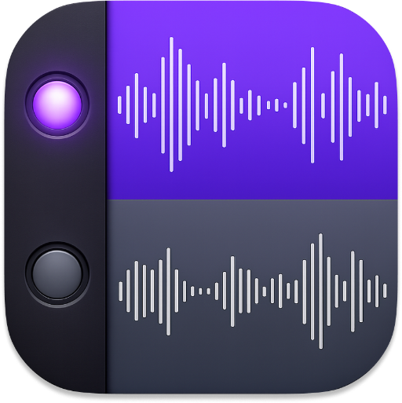
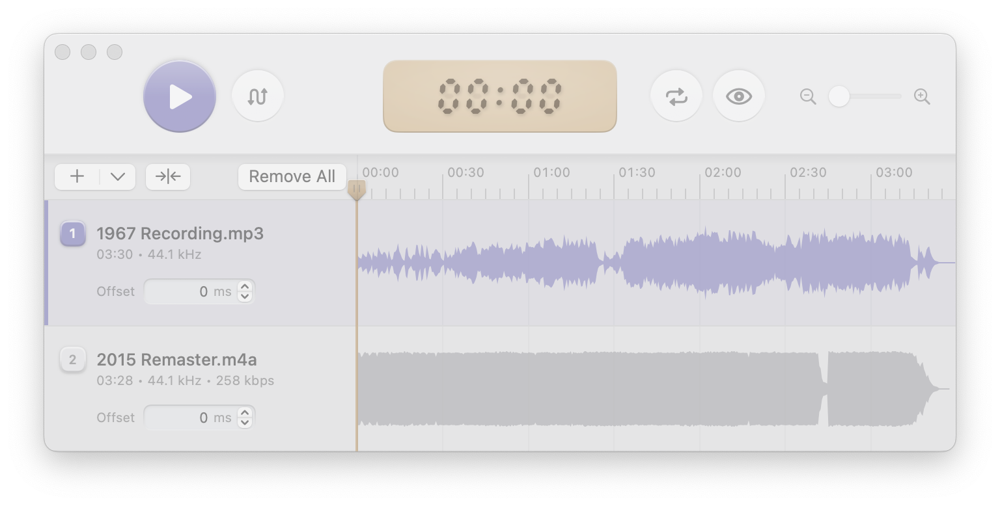

<p align="center">
  
</p>

<h1 align="center">Takes</h1>

<p align="center">
  A beautiful native macOS app for comparing multiple versions of audio tracks.
</p>

<p align="center">
  <a href="https://github.com/Nigelw/Takes/releases/latest/download/Takes.dmg"><strong>Download Latest</strong></a> &middot;
  <a href="https://takes.nigelwarren.com">Visit Website</a>
</p>

<p align="center">
  
</p>

Takes is a native macOS app for comparing multiple versions of the same audio track. It lets you rapidly switch between tracks during playback to evaluate mastering differences at the same point in the song.

---

This README is written for someone working on the repo. It covers project layout, how to build and run the app, the core playback model, and a brief operator guide for manual testing.

## Current Scope

The app currently supports:

- Loading up to 32 local audio files through the Open control, Finder selection, Music.app selection, drag-and-drop, or files opened from Finder
- Importing a track from a streaming URL (Apple Music, Spotify, YouTube, or YouTube Music), downloaded via a managed or system-installed yt-dlp
- Shared transport playback with only one track audible at a time
- Switching playback through loaded tracks in list order during playback, through the transport, Playback menu, number hotkeys, Up/Down arrow keys, or media remote commands
- Dragging files anywhere in the window to append to the track list
- Reordering loaded tracks by dragging rows, or dragging a row out of the window to copy its audio file to Finder or another app
- Resizable track info column for balancing metadata and waveform space
- Progressive waveform extraction and rendering for each loaded track
- Signed global timeline playback with a playhead over the waveform lanes
- Automatic track alignment that derives per-track offsets from the audio itself, with an optional deeper tempo analysis for takes recorded at slightly different speeds
- Optional automatic alignment when opening files
- Independent offset adjustment for each loaded track
- Repeat Off, Repeat One, and Switch & Repeat modes
- Timeline loop selection constrains playback inside a selected loop
- Timeline zooming, trackpad horizontal scroll, pinch zoom, zoom-to-fit, zoom-to-selection, and playhead-following during playback
- Blind Listening Mode, which hides source filenames/metadata/anonymizes placeholder waveforms and reshuffles visible track order while keeping playback on the same file
- Seeking across the full session range, including negative time when tracks have negative offsets
- Silence on a track when the current transport position falls outside that track's valid range
- App settings for theme, readout style, offset nudge sizes, auto-align-on-open, and software updates
- Developer-only Debug menu tools for component labels, window-size reset, and transport appearance tuning

## Requirements

- macOS
- Xcode with command line tools selected
- Finder and Music.app available if you want to use their selection import commands

The project is an Xcode app project, not a Swift package.

## Open And Run

Open the project:

```bash
open Takes.xcodeproj
```

In Xcode:

1. Select the `Takes` scheme.
2. Select `My Mac` as the run destination.
3. Press `Cmd-R`.

The app bundle produced by local builds typically ends up under:

```text
.derived-data/Build/Products/Debug/Takes.app
```

## Build And Test

Build:

```bash
xcodebuild -project Takes.xcodeproj -scheme Takes -configuration Debug -derivedDataPath .derived-data build
```

Compile the app and test targets:

```bash
xcodebuild -project Takes.xcodeproj -scheme Takes -configuration Debug -derivedDataPath .derived-data build-for-testing
```

Notes:

- `build-for-testing` is the most reliable repo-local verification command in this environment.
- Full `xcodebuild test` may be blocked in sandboxed environments because it depends on Apple test infrastructure processes outside the workspace.

## Repo Layout

```text
Takes/
├── Config/
│   └── Takes-Info.plist
├── Sources/Takes/
│   ├── AppSettings.swift
│   ├── AudioFileLoader.swift
│   ├── ComponentDebugLabel.swift
│   ├── ContentView.swift
│   ├── KeyMonitor.swift
│   ├── LibraryTrackSelectionLoader.swift
│   ├── Models.swift
│   ├── PlaybackController.swift
│   ├── SettingsView.swift
│   ├── SoftwareUpdater.swift
│   ├── TakesApp.swift
│   ├── Theme.swift
│   ├── TrackAligner.swift
│   ├── TransportControls.swift
│   ├── TransportMapping.swift
│   └── WaveformStore.swift
├── Tests/TakesTests/
│   ├── LoopingTests.swift
│   ├── SessionTests.swift
│   ├── TimelineHeaderMarkerTests.swift
│   ├── TrackAlignerTests.swift
│   ├── TrackDropHighlightTests.swift
│   ├── TransportMappingTests.swift
│   └── WaveformSourceTests.swift
└── Takes.xcodeproj/
```

## Architecture Overview

### UI

- `TakesApp.swift` creates the app windows, wires app/menu commands, handles files opened from Finder, configures remote media commands, and owns main-window sizing policy.
- `ContentView.swift` contains the SwiftUI interface, file importers, drag-and-drop handling, local keyboard monitoring, waveform/timeline UI, loop gestures, and the offset control UI.
- `AppSettings.swift` and `SettingsView.swift` own persisted user preferences and the Settings window.

### Playback

- `PlaybackController.swift` is the main coordinator for loading files, tracking session state, running the transport, scheduling playback, and updating audibility.
- Playback uses a single `AVAudioEngine` with:
  - one `AVAudioPlayerNode` per loaded track
  - one per-track mixer node per loaded track
- All loaded tracks are scheduled against the same transport model.
- Only the active track is audible at a time by muting the inactive tracks' mixer output.
- The app observes `AVAudioEngineConfigurationChange` and reschedules playback after route/configuration changes when possible.

### Transport Model

- `Models.swift` defines `LoadedTrack`, `SessionTrack`, `ComparisonSession`, and `PlaybackError`.
- `Models.swift` also defines `RepeatMode`, `LoopRegion`, and timeline ruler marker/layout helpers.
- `TransportMapping.swift` contains the pure transport math:
  - signed timeline bounds and range
  - transport-to-file position mapping
  - audibility checks
  - dB-to-linear gain conversion
- `TrackAligner.swift` contains the audio-derived quick alignment pass and slower tempo-analysis pass.
- `WaveformStore.swift` owns process-local waveform generation and caching.

Current transport behavior:

- The progress timeline is based on the union of loaded track ranges and the global 0:00 point.
- Negative offsets extend the visible timeline before 0:00.
- Positive offsets create leading empty space before the shifted track starts.
- If you switch to a track that is currently out of range, playback remains silent until transport re-enters that track's valid window.
- Repeat Off parks the playhead at the end of the playable range; the next Play starts from the beginning of the range.
- Repeat One restarts the current track at the beginning of the playable range.
- Switch & Repeat advances to the next track and restarts; with one track it behaves like Repeat One.
- When a loop is selected, the playable range becomes the loop range until the loop is deselected.
- Timeline zoom changes the visible window, not the underlying session range.

### File Loading

- `AudioFileLoader.swift` reads local audio files through `AVAudioFile`.
- `LibraryTrackSelectionLoader.swift` uses AppleScript against `com.apple.Music` to read the current Music.app selection and validate that it points to local files.
- Finder selection import reads selected audio files from Finder and appends them through the same loading path as the Open dialog.
- Opening files or folders from Finder routes through `AppOpenedURLResolver`; folders are recursively scanned for audio files.
- Duplicate files are ignored by standardized, symlink-resolved file URL.

### Tests

- `TransportMappingTests.swift` covers transport math and range behavior.
- `SessionTests.swift` covers higher-level state, import behavior, Music/Finder selection handling, numeric control stepping behavior, blind listening, window policy, and other non-UI logic.
- `LoopingTests.swift`, `TimelineHeaderMarkerTests.swift`, `TrackAlignerTests.swift`, `TrackDropHighlightTests.swift`, and `WaveformSourceTests.swift` cover their named subsystems.

## Important Behavior Notes

- Playback is allowed with only one loaded track.
- Switching playback requires at least two loaded tracks.
- Removing a track preserves the remaining tracks' offset values.
- Removing all tracks clears the loop, blind listening state, transport state, and loaded waveform state.
- Enabling Blind Listening Mode reshuffles visible row order and hides track names/metadata; disabling it restores filename/metadata visibility.
- If Blind Listening Mode is already on when tracks are imported, the session reshuffles again after import.
- Bare `Delete` removes the active track only when global menu shortcuts are allowed; active numeric text fields keep normal text editing behavior.
- Music import requires Automation permission to control Music.
- The app includes `NSAppleEventsUsageDescription` for that permission prompt.
- If more tracks are imported than the session cap allows, Takes loads available slots and reports skipped files.

## Brief Operator Guide

### Loading Audio

- Use the main `+` segment above the track info area, File > Open, or `Cmd+O` to append one or more local files.
- Drag files anywhere in the window to append them to the track list.
- Drop a file on a specific row to replace that track.
- Drag track rows to reorder them.
- Drag the divider between the track info column and waveform area to resize the track info column.
- Use File > Quick Open from Finder or `Shift+Cmd+F` to import selected audio files from Finder.
- Use the `+` menu above the track info area and choose `Quick Open from Apple Music` to import the current Music.app selection.
- Use File > Open Streaming URL or `Shift+Cmd+O` to import a track from an Apple Music, Spotify, YouTube, or YouTube Music URL. This downloads audio through yt-dlp, which Takes manages automatically (falling back to a system-installed copy) and keeps updated in Settings > Updates.
- Use File > Show in Finder or `Shift+Cmd+R` to reveal the active track.
- Use File > Remove Track (`Delete`) or File > Remove All Tracks (`Cmd+Delete`) to clear tracks from the session.
- Drag a track row out of the window to copy its audio file to Finder or another app.

Finder and Music import rules:

- Selected tracks append to the current track list.
- Multiple selected tracks load based on Finder selection order or Music's playlist/library view order.
- Takes supports up to 32 loaded tracks and reports any skipped files.
- The selected items must be local files on disk.

### Playback

- `Space`: play/pause
- `X` / `Down`: switch playback to the next loaded track in list order
- `Shift+X` / `Up`: switch playback to the previous loaded track in list order
- `1`...`9`: make the matching row active
- `0`: make the last loaded row active when there are more than eight tracks
- `Left` / `Right`: seek by 1 second
- `Shift+Left` / `Shift+Right`: seek by 10 seconds
- `Cmd+Left` / `Cmd+Right`: jump to the start/end of the timeline
- `Cmd+B`: toggle Blind Listening Mode
- `Cmd++` / `Cmd+-`: zoom in/out
- `Option+Cmd++`: zoom to the selected loop
- `Option+Cmd+-`: zoom to fit
- `Cmd+D`: deselect the current loop

The Playback menu mirrors the main transport actions and includes Auto-Align Tracks (`Option+Cmd+A`) plus the Repeat mode picker.

### Timeline, Looping, And Zoom

- Real waveform lanes render progressively as files decode in the background.
- Click or drag in a waveform lane to seek.
- Drag in the timeline ruler or waveform column to create a loop selection.
- Drag either loop edge to resize the loop.
- Deselect the loop with `Cmd+D` or Edit > Deselect.
- Use the zoom buttons, menu commands, trackpad pinch, or horizontal scroll to inspect the visible timeline window.
- During playback, the timeline follows the playhead when zoomed in.

### Offset Controls

- Each loaded track has an offset control.
- Sliders and numeric fields stay in sync.
- Numeric fields support arrow-key stepping:
  - offset: `Up/Down = the configured nudge`, `Shift+Up/Down = the configured large nudge`
- Double-clicking the `ms` input field laber resets the value to `0`.
- Press `Enter` or click outside a numeric field to end editing and return keyboard control to transport shortcuts.

### Settings And Debug Tools

- Settings > General controls theme, readout frame, Align Tracks on Open, and offset nudge amounts.
- Settings > Updates controls automatic update checks and downloads, and shows yt-dlp's update status with a manual "Check Now" option.
- Help > Debug > Show Component Names overlays developer labels on major UI regions.
- Help > Debug > Reset Window Size restores the main window to its default width and launch height.
- Help > Debug > Appearance Tuner opens a session-only tuning window for transport button and index badge appearance.

For automated screenshots, launch with a non-persistent theme override:

```bash
open .derived-data/Build/Products/Debug/Takes.app --args --appearance-theme dark
```

The override accepts `system`, `light`, or `dark`. To prepare the next launch through the app's persisted preference instead, use:

```bash
defaults write com.nigelwarren.Takes appearanceTheme dark
```

## Manual Verification Checklist

Useful spot checks after changing playback or UI behavior:

1. Confirm the top transport shows play/pause, switch, blind listening, auto-align, zoom, repeat, and signed time readout controls.
1. Confirm the + dropdown above the track info area contains Quick Open from Finder and Quick Open from Apple Music.
1. Use the + button with one file and confirm it creates Track 1 and makes it active.
1. Use the + button with additional files and confirm they append in order.
1. Use the + button with more than 32 files and confirm the app loads available slots and reports skipped files.
1. Use a mixed valid/invalid import and confirm successful files append while failures are reported together.
1. Confirm Switch Playback is disabled with one loaded track and cycles through three or more tracks in row order.
1. Confirm waveform lanes render progressively for loaded tracks.
1. Confirm positive offset creates leading blank space.
1. Confirm negative offset extends the visible timeline left of zero.
1. Confirm the playhead line spans the visible track lanes.
1. Click in a waveform lane and confirm it seeks.
1. Click the track info area and confirm it changes the active track.
1. Confirm offset controls are visible for each loaded track.
1. Drop a file anywhere in the window and confirm it appends to the track list.
1. Drop multiple files anywhere in the window and confirm they append.
1. Drag a row and confirm the session order changes without changing the active file unexpectedly.
1. Remove a non-active track during playback and confirm playback continues.
1. Remove the active track and confirm playback pauses and selects the next track, or previous if the removed track was last.
1. Toggle Repeat Off, One, and Switch & Repeat and confirm end-of-range behavior.
1. Drag a loop selection, play through it, resize it, then deselect it.
1. Zoom in/out, zoom to fit, and zoom to selection; confirm scroll/pinch keep the playhead and ruler aligned.
1. Toggle Blind Listening Mode and confirm rows show anonymous labels/placeholder waveforms without shifting layout.
1. Use Finder selection import, Music selection import, and Show in Finder from both the UI/menu paths where applicable.

## Known Constraints

- The UI is entirely SwiftUI/AppKit-bridged for control behavior; there are no UI automation tests yet.
- Waveform caching is process-local only; waveforms are regenerated after relaunch.
- Music integration depends on AppleScript and macOS Automation permissions.
- Test execution may be environment-dependent even when `build-for-testing` succeeds.
- Distribution assets and release scripts exist, but this README focuses on local development and manual verification.
