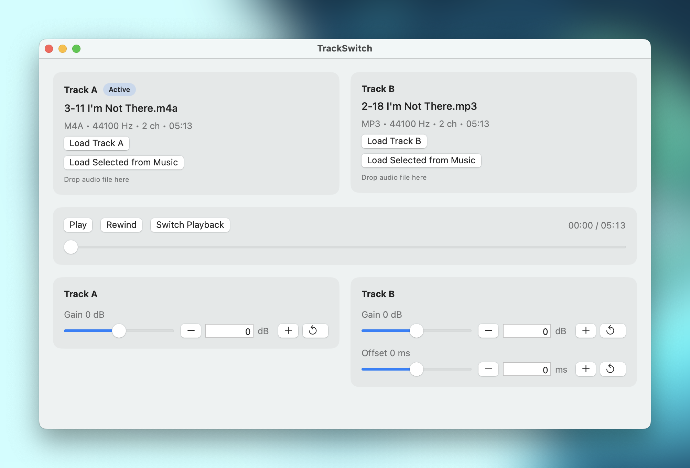

# TrackSwitch

<p align="center">
  
</p>

TrackSwitch is a native macOS app for comparing two versions of the same audio track. It keeps both tracks aligned on a shared transport timeline and lets you switch playback between them instantly so you can evaluate mastering differences at the same point in the song.



This README is written for someone working on the repo. It covers project layout, how to build and run the app, the core playback model, and a brief operator guide for manual testing.

## Current Scope

The app currently supports:

- Loading local audio files into Track A and Track B
- Dragging files onto the Track A / Track B header areas
- Importing the current selection from Music.app
- Loading one selected Music track into the clicked side
- Loading two selected Music tracks into A and B, ordered by Music's current view order
- Shared transport playback with only one track audible at a time
- Switching playback between A and B during playback
- Seeking across the full session range
- Independent gain trim per track
- Manual offset adjustment for Track B
- Silence on a track when the current transport position falls outside that track's valid range

Out of scope at the moment:

- Waveforms
- Loudness analysis
- Automatic alignment
- Session persistence
- Export / rendering

## Requirements

- macOS
- Xcode with command line tools selected
- Music.app installed if you want to use the Music selection import button

The project is an Xcode app project, not a Swift package.

## Open And Run

Open the project:

```bash
open /Users/Nigel/Developer/TrackSwitch/TrackSwitch.xcodeproj
```

In Xcode:

1. Select the `TrackSwitch` scheme.
2. Select `My Mac` as the run destination.
3. Press `Cmd-R`.

The app bundle produced by local builds typically ends up under:

```text
/Users/Nigel/Developer/TrackSwitch/.derived-data/Build/Products/Debug/TrackSwitch.app
```

## Build And Test

Build:

```bash
xcodebuild -project TrackSwitch.xcodeproj -scheme TrackSwitch -configuration Debug -derivedDataPath .derived-data build
```

Compile the app and test targets:

```bash
xcodebuild -project TrackSwitch.xcodeproj -scheme TrackSwitch -configuration Debug -derivedDataPath .derived-data build-for-testing
```

Notes:

- `build-for-testing` is the most reliable repo-local verification command in this environment.
- Full `xcodebuild test` may be blocked in sandboxed environments because it depends on Apple test infrastructure processes outside the workspace.

## Repo Layout

```text
TrackSwitch/
├── Config/
│   └── TrackSwitch-Info.plist
├── Sources/TrackSwitch/
│   ├── AudioFileLoader.swift
│   ├── ContentView.swift
│   ├── KeyMonitor.swift
│   ├── LibraryTrackSelectionLoader.swift
│   ├── Models.swift
│   ├── PlaybackController.swift
│   ├── TrackSwitchApp.swift
│   └── TransportMapping.swift
├── Tests/TrackSwitchTests/
│   ├── SessionTests.swift
│   └── TransportMappingTests.swift
└── TrackSwitch.xcodeproj/
```

## Architecture Overview

### UI

- `TrackSwitchApp.swift` creates the app window.
- `ContentView.swift` contains the SwiftUI interface, file importers, drag-and-drop handling, keyboard shortcut monitoring, and the gain/offset control UI.

### Playback

- `PlaybackController.swift` is the main coordinator for loading files, tracking session state, running the transport, scheduling playback, and updating audibility.
- Playback uses a single `AVAudioEngine` with:
  - two `AVAudioPlayerNode`s
  - two per-track mixer nodes
- Both tracks are scheduled against the same transport model.
- Only one track is audible at a time by muting the inactive track's mixer output.

### Transport Model

- `Models.swift` defines `LoadedTrack`, `ComparisonSession`, `TrackSide`, and `PlaybackError`.
- `TransportMapping.swift` contains the pure transport math:
  - session duration
  - overlap range
  - transport-to-file position mapping
  - audibility checks
  - dB-to-linear gain conversion

Current transport behavior:

- The progress bar is based on the union of the loaded track ranges, not just their overlap.
- If one track is shorter, playback continues to the end of the longer session range.
- If you switch to a track that is currently out of range, that side remains silent until transport re-enters its valid window.

### File Loading

- `AudioFileLoader.swift` reads local audio files through `AVAudioFile`.
- `LibraryTrackSelectionLoader.swift` uses AppleScript against `com.apple.Music` to read the current Music.app selection and validate that it points to local files.

### Tests

- `TransportMappingTests.swift` covers transport math and range behavior.
- `SessionTests.swift` covers higher-level state, Music selection handling, numeric control stepping behavior, and other non-UI logic.

## Important Behavior Notes

- Playback is allowed with only one loaded track.
- Switching playback requires both tracks to be loaded.
- Track B keeps its own gain and offset values when you replace the file.
- Music import requires Automation permission to control Music.
- The app includes `NSAppleEventsUsageDescription` for that permission prompt.
- If more than two tracks are selected in Music, the import should fail with a user-facing error.

## Brief Operator Guide

### Loading Audio

- Use `Load Track A` or `Load Track B` to import local files.
- Drag a compatible audio file onto the Track A or Track B header area.
- Use `Load Selected from Music` to import the current Music.app selection.

Music import rules:

- If one track is selected, it loads into the side whose button you clicked.
- If two tracks are selected, they load into Track A and Track B based on Music's playlist/library view order.
- If the selection contains more than two tracks, the app shows an error.
- The selected Music items must be local files on disk.

### Playback

- `Space`: play/pause
- `X`: switch playback between Track A and Track B
- `Left` / `Right`: seek by 1 second
- `Shift+Left` / `Shift+Right`: seek by 5 seconds

### Gain And Offset Controls

- Both tracks have gain controls.
- Track B also has offset controls.
- Sliders and numeric fields stay in sync.
- Numeric fields support arrow-key stepping:
  - gain: `Up/Down = 1 dB`, `Shift+Up/Down = 10 dB`
  - offset: `Up/Down = 10 ms`, `Shift+Up/Down = 100 ms`
- `Reset` returns the value to `0`.
- Double-clicking a slider thumb also resets it to `0`.
- Press `Enter` or click outside a numeric field to end editing and return keyboard control to transport shortcuts.

## Manual Verification Checklist

Useful spot checks after changing playback or UI behavior:

1. Load a single file and confirm play/seek/stop work.
2. Load both tracks and confirm `Switch Playback` changes the audible side without restarting transport.
3. Load two tracks with different durations and confirm playback continues to the longer one.
4. Toggle to the shorter track after it has ended and confirm it stays silent.
5. Adjust Track B offset and confirm playback reschedules correctly.
6. Use the numeric fields and confirm normal-step and large-step arrow behavior.
7. Import one and then two tracks from Music and confirm assignment and validation rules.

## Known Constraints

- The UI is entirely SwiftUI/AppKit-bridged for control behavior; there are no UI automation tests yet.
- Music integration depends on AppleScript and macOS Automation permissions.
- Test execution may be environment-dependent even when `build-for-testing` succeeds.
- The repo currently targets local development in Xcode rather than distribution packaging or notarized release workflows.
